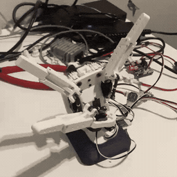

# LaMain

The smallest three-finger end-effector with tactile feedback that replaces the SO-101 gripper. It succeeds where the gripper fails, with the dataset and policy to prove it.

<p align="center">
  
</p>

## Status

An early prototype. The goal is a low-cost, low-weight hand for the SO-101 arm, with LeRobot integration planned.

Five Feetech SCS0009 servos drive `index_flex`, `middle_flex`, `index_middle_abd`, `thumb_rot` and `thumb_flex`. Their geometry and limits come from the `hand_model.yaml` bundled in `lamain-core`.

The code already handles automatic calibration at reduced torque, a safety filter for range and step limits, the `HandController` command layer, a keyboard studio for gestures and playback, and per-joint diagnostics. Tests run on a simulated bus, so no hardware is needed.

## Quickstart

```bash
uv sync                 # install the workspace and dependencies
uv run lamain --help    # CLI overview
uv run pytest           # tests on FakeBus, no hardware
```

## Repository layout

```
lamain/
├── packages/lamain-core/   # reusable library (bus, calibration, safety, controller, demos)
├── packages/lamain-cli/    # the `lamain` CLI (bus, assemble, calibrate, studio, inspect)
├── hands/LM-0001/          # per-hand data, build manifest and calibration files
├── demos/                  # gestures and episodes
├── docs/                   # roadmap and decision records
└── tests/                  # FakeBus tests, run in CI
```

## Roadmap

Next milestones and the planned benchmark are in [docs/ROADMAP.md](docs/ROADMAP.md).

## Hardware

The bill of materials is on the [LaMain BOM](https://docs.google.com/spreadsheets/d/1QRkrFNEr4OLIYoRjOxhvR7IqRy3qPOLTq45OjTfyoFY/edit?usp=sharing). CAD rev A is not published yet.

## Design principle

Standardize what the sensor sees, diversify everything else.

## License

Software ships under Apache-2.0, see [LICENSE](LICENSE). The hardware licence is still pending, see [D-003](docs/decisions/D-003-licences.md). Datasets are CC-BY-4.0 and live on the Hugging Face Hub, not in git.

## Credits

Arthur Mourgue and Julien Navet (CAD). Inspired by Pollen Robotics' [AmazingHand](https://github.com/pollen-robotics/AmazingHand).
